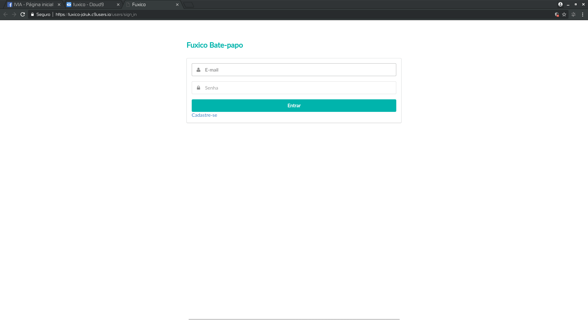
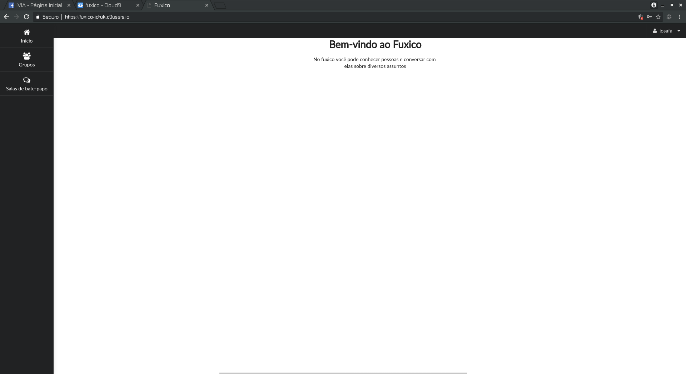
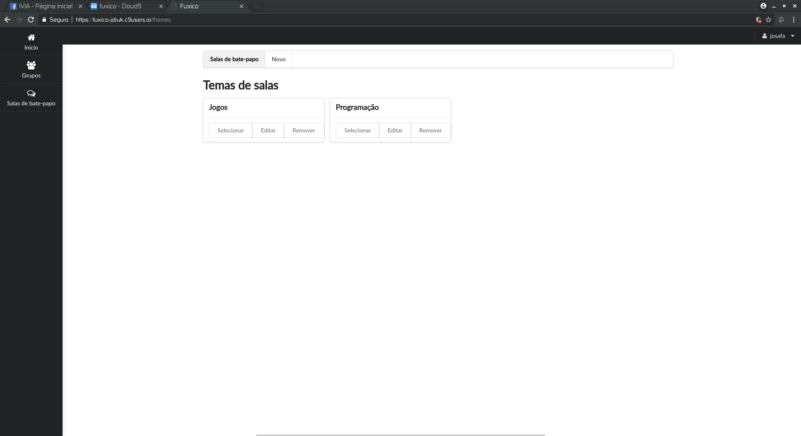
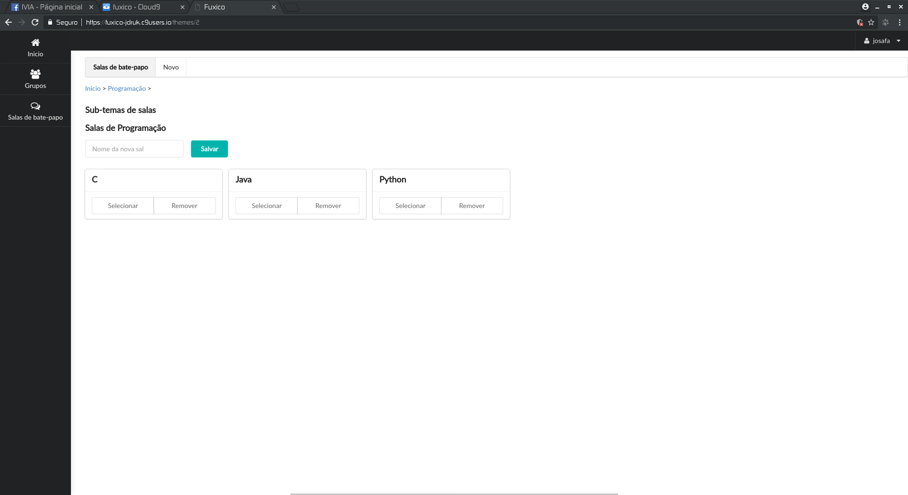
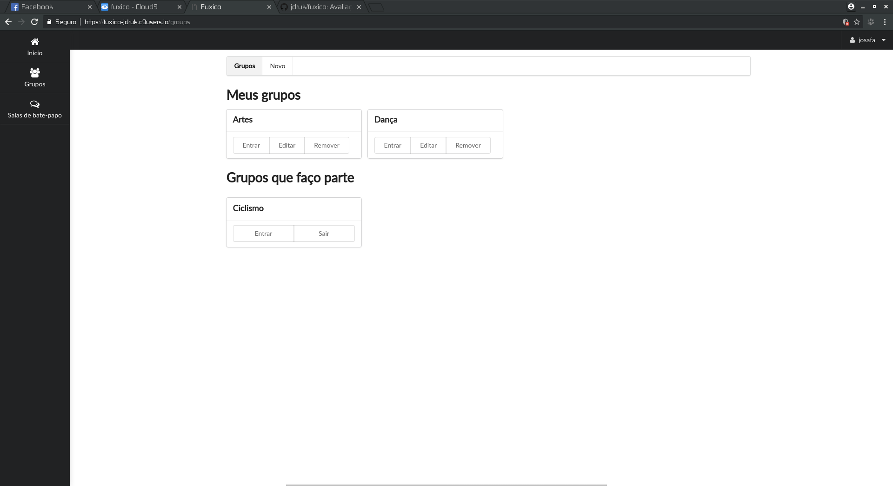
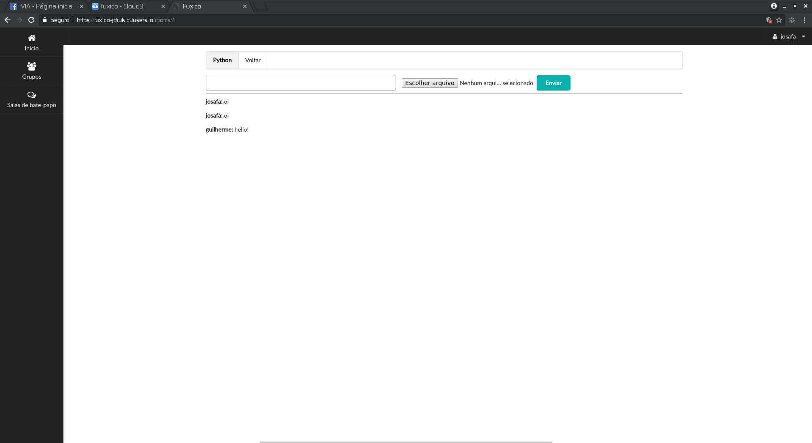

Chat desenvolvido para disciplina Sistemas Distruibuídos

Nodejs, python e ruby on rails foram utilizadas na implementação dessa ferramenta.

## Telas

### Divisão entre Salas de Temas, Sub-temas e Grupos.

Grupos em que o usuário foi adicinado ou que criou.

É possível enviar arquivo pela plataforma.

